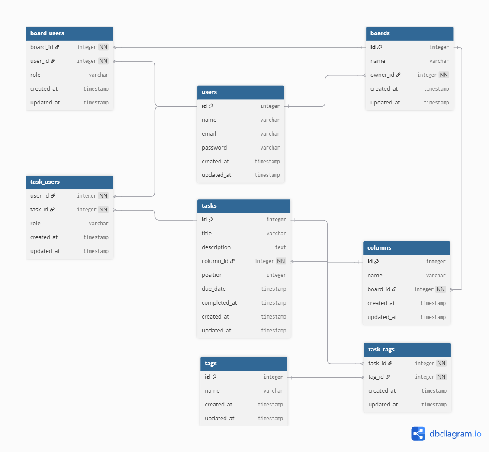

### Kanban Board System

A Kanban board system built with Node.js, Prisma, and PostgreSQL, running in Docker for easy setup.
---

## ✨ Features  

1. **Authentication**
   - Register & Login with JWT
   - User profile access  

2. **Board Management**
   - Create new boards  
   - Update board name  
   - Delete board  
   - View owned boards / joined boards / all boards  

3. **Board Collaboration**
   - Invite members to a board  
   - List all board members  

4. **Column Management**
   - Create, update, and delete columns  
   - View all columns in a board  
   - View column details with tasks  

5. **Task Management**
   - Create, update, and delete tasks  
   - Move task positions within a column  
   - View task by ID  

6. **Optional Enhancements**
   - Drag-and-drop tasks with mouse 🖱️  
   - Add tags to tasks  
   - Assign task owners/assignees  

---
## Project Structure (Clean Architecture)
```
KANBAN-BOARD-SYSTEM
├── docs/                  # Project documentation
├── logs/                  # Application logs
├── node_modules/          # Installed npm dependencies
├── prisma/                # Prisma ORM setup
│   ├── migrations/        # Database migration files
│   ├── schema.prisma      # Prisma schema definition
│   └── seed.js            # Script to seed initial data
├── src/                   # Main application source code
│   ├── api/               # API layer
│   │   ├── controllers/   # Handle request/response logic
│   │   ├── middlewares/   # Express middlewares (auth, logging, etc.)
│   │   └── routes/        # API routes
│   ├── config/            # Application configuration (DB, JWT, etc.)
│   ├── repositories/      # Database access layer (queries, persistence)
│   ├── schemas/           # Data validation schemas (Joi/Zod, etc.)
│   ├── services/          # Business logic layer
│   └── app.js             # Express app setup
├── server.js              # Application entry point
├── .env                   # Environment variables
├── .gitignore             # Git ignore configuration
├── docker-compose.yml     # Docker Compose setup
├── dockerfile             # Docker file setup
├── package.json           # Project dependencies and scripts
├── package-lock.json      # Locked dependency versions
└── README.md              # Project documentation
```

## Entity Relationship Diagram



## API Routes

### Board Routes
| Method | Endpoint                 | Description                | Auth |
|--------|--------------------------|----------------------------|------|
| POST   | api/boards                  | Create a new board         | ✅    |
| GET    | api/boards/owner            | Get boards you own         | ✅    |
| GET    | api/boards/member           | Get boards you joined      | ✅    |
| GET    | api/boards/all              | Get all boards             | ✅    |
| GET    | api/boards/:boardId         | Get board details          | ✅    |
| PUT    | api/boards/:boardId         | Update board               | ✅    |
| DELETE | api/boards/:boardId         | Delete board               | ✅    |
| POST   | api/boards/:boardId/members | Add member to board        | ✅    |
| GET    | api/boards/:boardId/members | List board members         | ✅    |

### Column Routes
| Method | Endpoint                       | Description             | Auth |
|--------|--------------------------------|-------------------------|------|
| POST   | api/columns                       | Create column           | ✅    |
| GET    | api/columns/:boardId              | Get all columns in board| ✅    |
| GET    | api/columns/:columnId/:boardId    | Get column details      | ✅    |
| PUT    | api/columns/:columnId             | Update column           | ✅    |
| DELETE | api/columns/:columnId/boards/:boardId | Delete column       | ✅    |

### Task Routes
| Method | Endpoint          | Description       | Auth |
|--------|------------------|-------------------|------|
| POST   | api/tasks           | Create task       | ✅    |
| GET    | api/tasks/:taskId   | Get task by id    | ✅    |
| PUT    | api/tasks/:taskId   | Update task       | ✅    |
| DELETE | api/tasks/:taskId   | Delete task       | ✅    |
| PUT    | api/tasks/:taskId/move | Move task      | ✅    |

### Auth Routes
| Method | Endpoint   | Description    | Auth |
|--------|-----------|----------------|------|
| POST   | api/users/register | Register user | ❌ |
| POST   | api/users/login    | Login user    | ❌ |
| GET    | api/users/profile  | Get profile   | ✅ |

## Setup Instructions
### 1.Clone the repo

```bash
git clone https://github.com/Thanthiti/Kanban-Board-System.git
cd Kanban-Board-System
```

### 2.Setup Environment Variables for docker
```bash
cp .env.example .env
```
### 3.Start the App with Docker Compose
```bash
docker-compose up --build
```
### 4.Run Prisma Migration (inside container) 
```bash
docker compose exec app npx prisma migrate dev --name init
````
### 5.Run Seed Data (inside container)
```bash
docker compose exec app npx prisma db seed
```
### 6.Verify the Results

Open pgAdmin in your browser:
👉 http://localhost:5050

Use the credentials from your .env file
## Thank you ## 
